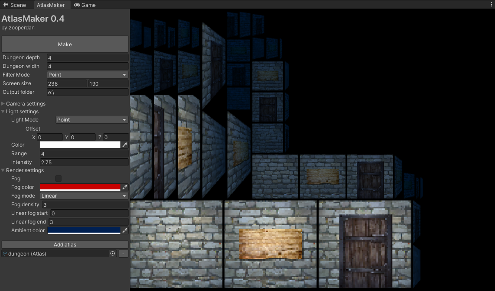

# AtlasMaker for 2D Dungeon Crawlers
 A package for Unity which will allow you to render images atlases to be used in developing first person grid dungeon crawlers.
 
 

## How to use
 
No time to write this yet but it's pretty straightforward to use. If you run into any problems or have some questions or suggestions then find me on the dungeoncrawler.org [Discord server](https://discord.gg/XerEseQ) or Twitter ([@zooperdan](https://twitter.com/zooperdan)).

## Installation

Download [AtlasMaker-for-2D-Dungeon-Crawlers.unitypackage](Package/AtlasMaker-for-2D-Dungeon-Crawlers.unitypackage) and import it into a Unity project.

There is only one required package and it can be downloaded from the built-in package manager.
> Package: Editor Coroutines (com.unity.editorcoroutines)

## Change log

Version 0.5

>	- Rewrote and optimized the render/grab image process quite a bit.
>	- Added layer type property to AtlasLayer. It was previously located on the Atlas itself. Now it's removed from there.
>	- Added "Enabled" property to AtlasLayer. Uncheck this if you don't want this layer to be renderered to the atlas.
>	- Added "Render both sides" property to AtlasLayer. Check this to render all tiles, not just the ones left of center.
	
	Note: Rendering both sides allow you to have atlas layers with 3D objects that have depth.
	If unchecked the left side will have to be flipped in-game before rendering it on the right side.
	The drawback of rendering both sides is that the atlas filesize is considerably larger.

Version 0.4

>	- Added option to use either a Point Light or a Directional Light to light up the rendered output.
>	- Added ambient light color parameter.
>	- Fixed a bug with the rendering of Object type Atlases.
