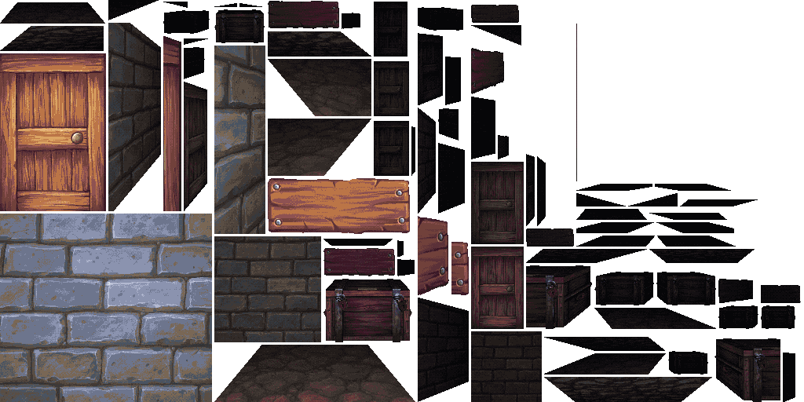
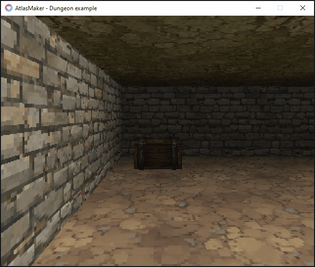
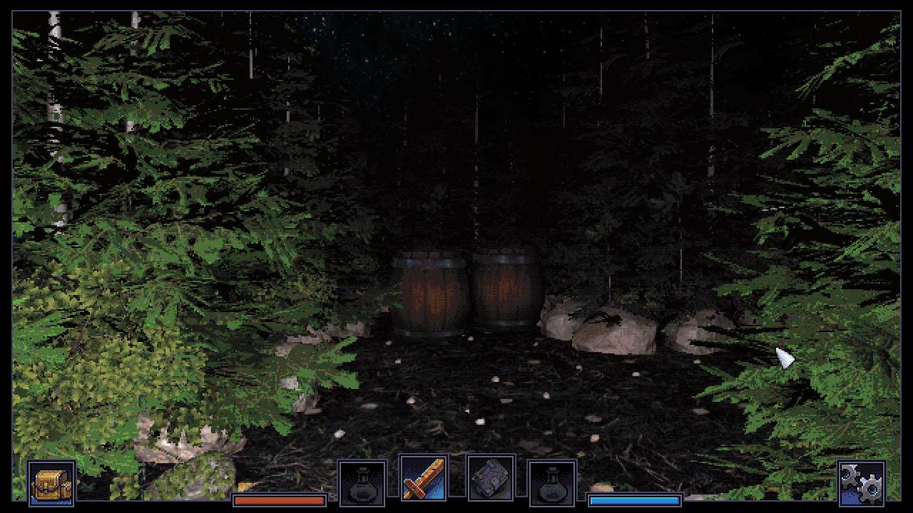
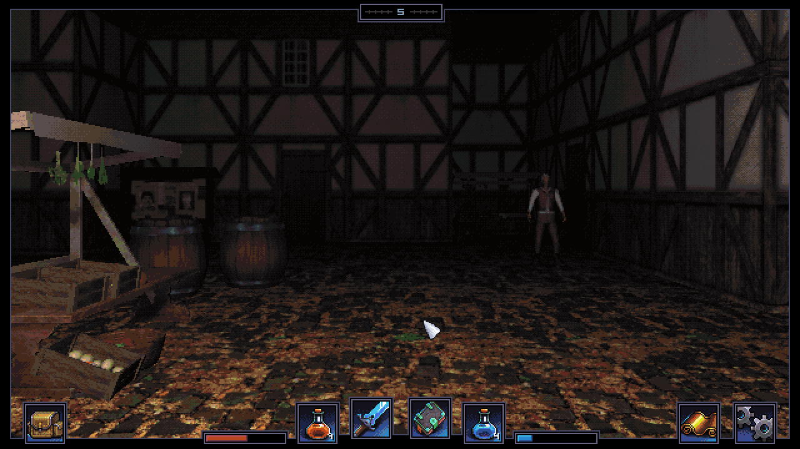

# AtlasMaker for 2D Dungeon Crawlers
 A package for Unity which will allow you to render images atlases to be used in developing first person grid dungeon crawlers.
 
 

## How to use

Read the [Documentation](/Docs/documentation.md) for a quick break-down of the tool.

If you run into any problems or have some questions or suggestions then find me on the dungeoncrawler.org [Discord server](https://discord.gg/XerEseQ) or Twitter ([@zooperdan](https://twitter.com/zooperdan)).

## Installation

Download [AtlasMaker-for-2D-Dungeon-Crawlers.unitypackage](Package/AtlasMaker-for-2D-Dungeon-Crawlers.unitypackage) and import it into a Unity project.

There are two required packages and they can be downloaded from the built-in package manager.
>	- Editor Coroutines
>	- Post-Processing Stack v2

## Example project

You might want to check out a small [Example project](/Example/LÖVE/) for the [LÖVE](https://love2d.org/) framework which demonstrates atlas loading and rendering of a dungeon.

Please note that the example is unoptimized and the dungeon rendering could likely be implemented in better ways but it should be enough to get you started.

## Showcase

I wrote a game for the [Dungeon Crawler Jam 2022](https://itch.io/jam/dcjam2022) using graphics generated by AtlasMaker.

Check it out here: [It Came from the Forest](https://zooperdan.itch.io/it-came-from-the-forest)

| Screenshot 1  | Screenshot 2 |
| :------------- |  :------------- |
|   |   |

## TO-DO

>	- Implement two types of atlas packing.
>		- Optimized (This is the current one that is already implemented).
>		- Layed out. This method will arrange the atlas in a way so the side walls are connected to each other like they would be when rendered in a dungeon. This makes it easy to use this as a template for manual pixelling on top.
>	- Output the atlas data to other formats in addition to JSON (LUA, XML, CSV, BINARY etc.)
>	- Option to write the image output to separate image files instead of a single atlas image.
>	- Documentation on how to use this tool.

## Change log

Version 0.9.4

>	- Added four new export formats:
>		- Comma separated values (CSV)
>		- XML
>		- [LUA Table](https://www.lua.org/pil/2.5.html)
>		- [Binary](/Docs/export-binary.md)
>	- Changed the default textures.

Version 0.9.3

>	- Removed any Skybox in Lighting/Environment. Having a skybox there may sometimes create some pixel artifacts.
>	- Fixed the fog so that it works in deferred rendering mode. Unfortunately this means that AtlasMaker now require the Unity Post-Processing Stack package.
>	- You can now override dungeon depth and width per atlas layer.
>	- Fixed a bug which sometimes occurred when adding a new atlas.

Version 0.9.2

>	- Added option on mark atlas layers for rendering from a given side. This is useful if you want to be able to walk around the object in-game. This only applies to atlas layers of type "OBJECT".
>	- Moved the Enabled property from atlas to the list of atlases in AtlasMaker window.
>	- Fixed wonky positions in the included prefabs. Now everything is posistioned at the origin (0,0).

Version 0.9.1

>	- Added properties for toggle dithering of generated atlas and to set the dither strength.

Version 0.9

>	- Now you can assign a palette and the generated output will be color quantized to match. No dithering yet but that will come.
>	- Added a property under light settings where you can toggle shadow casting.
>	- Added a property under light settings where you can set the shadow strength.
>	- Changed camera rendering method to deferred for better visual result.

Version 0.8

>	- Now you can have multiple AtlasMakerSettings files. This is useful if you are generating atlases for different projects.
>	- Removed all .Space() calls in the inspector code so that AtlasMaker now also works on older versions of Unity. It is however recommended to use a recent version whenever possible.
>	- Changed default ambient color to white so that there are visible pixels even when there is a combination of lit material and no light source.

Version 0.7

>	- Added a "Preview filtering" property in other settings rollout which toggles between interpolated and nearest neighbour scaling for the preview window.
>	- Added a "Render Mode" property for atlas layers (and removed the "Both sides" property) which controls the method which the layers are rendered.
>		- LEFT: The grid tiles in the middle column and left of it are rendered.
>		- MIDDLE: Only the grid tiles in the middle column is rendered
>		- ALL: The grid tiles on the left, middle and right side are rendered. 

Version 0.6

>	- Added rendering of ground and ceiling tiles.
>	- Fixed so that preview scales stretched to fit while keeping aspect ratio.
>	- Added a property in Other settings which allows you to change background color of the preview window.

Version 0.5

>	- Rewrote and optimized the render/grab image process quite a bit.
>	- Added layer type property to AtlasLayer. It was previously located on the Atlas itself. Now it's removed from there.
>	- Added "Enabled" property to AtlasLayer. Uncheck this if you don't want this layer to be renderered to the atlas.
>	- Added "Render both sides" property to AtlasLayer. Check this to render all tiles, not just the ones left of center.
	
	Note: Rendering both sides allow you to have atlas layers with 3D objects that have depth.
	If unchecked the left side will have to be flipped in-game before rendering it on the right side.
	The drawback of rendering both sides is that the atlas filesize is considerably larger.

Version 0.4

>	- Added option to use either a Point Light or a Directional Light to light up the rendered output.
>	- Added ambient light color parameter.
>	- Fixed a bug with the rendering of Object type Atlases.
